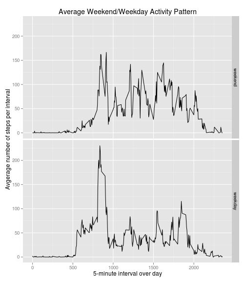

# Reproducible Research: Peer Assessment 1

This is an assignment for the course *Reproducible Research* by Roger Peng on Coursera to
write a report about the given dataset below in a **single R markdown** document that can 
be processed by **knitr** and be transformed into an HTML file.

## Introduction 

It is now possible to collect a large amount of data about personal
movement using activity monitoring devices such as a
[Fitbit](http://www.fitbit.com), [Nike
Fuelband](http://www.nike.com/us/en_us/c/nikeplus-fuelband), or
[Jawbone Up](https://jawbone.com/up). These type of devices are part of
the "quantified self" movement -- a group of enthusiasts who take
measurements about themselves regularly to improve their health, to
find patterns in their behavior, or because they are tech geeks. But
these data remain under-utilized both because the raw data are hard to
obtain and there is a lack of statistical methods and software for
processing and interpreting the data.

This assignment makes use of data from a personal activity monitoring
device. This device collects data at 5 minute intervals through out the
day. The data consists of two months of data from an anonymous
individual collected during the months of October and November, 2012
and include the number of steps taken in 5 minute intervals each day.

## Data

The data for this assignment can be downloaded from the course web
site:

* Dataset: [Activity monitoring data](https://d396qusza40orc.cloudfront.net/repdata%2Fdata%2Factivity.zip) [52K]

The variables included in this dataset are:

* **steps**: Number of steps taking in a 5-minute interval (missing
  values are coded as `NA`)

* **date**: The date on which the measurement was taken in YYYY-MM-DD
  format

* **interval**: Identifier for the 5-minute interval in which
  measurement was taken

The dataset is stored in a comma-separated-value (CSV) file and there
are a total of 17,568 observations in this
dataset.

## Loading and preprocessing the data

To work with the data set it is requested that the file called **activity.zip** is located in the current
working directory together with this RMarkdown document. The following code does unzip the file and reads the data contained in **activity.csv** into the R data frame **dat**. It preprocesses the data by converting the date variable into a date class. Finally it will print out a summary of the data frame loaded into R where we can already see that we have 2304 missing values coded as `NA` for the *steps* variable.


```r
## This option fixes an error in knitr not showing correct summary() reports
## See https://github.com/yihui/knitr/issues/768 for more information
options(digits = 7)
## Unzip the original data file
unzip("activity.zip")
## Load unzipped data into data frame <dat>
dat <- read.csv("activity.csv", stringsAsFactors = FALSE)
## Convert date variable into date class
dat$date <- as.Date(dat$date, format = "%Y-%m-%d")
## Print summary of loaded data for overview
summary(dat)
```

```
##      steps             date               interval     
##  Min.   :  0.00   Min.   :2012-10-01   Min.   :   0.0  
##  1st Qu.:  0.00   1st Qu.:2012-10-16   1st Qu.: 588.8  
##  Median :  0.00   Median :2012-10-31   Median :1177.5  
##  Mean   : 37.38   Mean   :2012-10-31   Mean   :1177.5  
##  3rd Qu.: 12.00   3rd Qu.:2012-11-15   3rd Qu.:1766.2  
##  Max.   :806.00   Max.   :2012-11-30   Max.   :2355.0  
##  NA's   :2304
```


## What is mean total number of steps taken per day?

We will first remove the missing values coded as `NA` *before* we are processing the dataset using the `na.omit()` function and assign it to a new cleaned data frame called **datcln**. The `summary()` of the new dataset shown no NA values anymore.


```r
datcln <- na.omit(dat)
summary(datcln)
```

```
##      steps             date               interval     
##  Min.   :  0.00   Min.   :2012-10-02   Min.   :   0.0  
##  1st Qu.:  0.00   1st Qu.:2012-10-16   1st Qu.: 588.8  
##  Median :  0.00   Median :2012-10-29   Median :1177.5  
##  Mean   : 37.38   Mean   :2012-10-30   Mean   :1177.5  
##  3rd Qu.: 12.00   3rd Qu.:2012-11-16   3rd Qu.:1766.2  
##  Max.   :806.00   Max.   :2012-11-29   Max.   :2355.0
```


### Histogram of the total number of steps taken each day

We will then take a look at the **histogram** of the *total number of steps* taken each day with the cleaned dataset to see the distribution of how many days a certain amount of workout (i.e. a range of total number of steps taken per day) was achieved. Here we use the *cleaned* dataset **datcln** where all the observations with missing values have been removed beforehand from the original data.


```r
## Extract all unique dates from observations
alldays <- unique(datcln$date)
## Create new data frame with sum of all steps per day ignoring missing
## values (NAs)
stepsum <- data.frame(steps = 1:length(alldays), date = as.Date("2014/06/12"))
for (idx in 1:length(alldays)) {
    stepsum$steps[idx] <- sum(datcln$steps[datcln$date == as.Date(alldays[idx])])
    stepsum$date[idx] <- as.Date(alldays[idx])
}
## Create histogram plot
hist(stepsum$steps, breaks = 20, main = "Total Number Of Steps Taken Each Day (No NA's)", 
    xlab = "Total number of steps taken each day", ylab = "Days")
```

 


With the cleaned dataset we can see that we have 2 days with a low workout activity with less than a 1000 total steps per day:


```r
stepsum[stepsum$steps < 1000, ]
```

```
##    steps       date
## 1    126 2012-10-02
## 39    41 2012-11-15
```


### Mean and median total number of steps taken per day

In the next step we calculate the **mean** and **median** of the total number of steps taken per day from the cleaned dataset with no missing values for the 53 days of observations ranging from 2012-10-02 to 2012-11-29 using the `summary()` function on the *cleaned* datset.


```r
## Mean of Total Number Of Steps per Day
summary(stepsum$steps)[4]
```

```
##  Mean 
## 10770
```

```r
## Median of Total Number Of Steps per Day
summary(stepsum$steps)[3]
```

```
## Median 
##  10760
```


Note that the original dataset with the missing values covers a time frame of 61 days ranging from 2012-10-01 to 2012-11-30.

## What is the average daily activity pattern?

### Time series plot of average number of steps per 5-minute interval

In this section we make a time series plot of the 5-minute interval for a day and plot the *average number of steps taken per interval*, averaged across all days to obtain a typical activity pattern over the time of the day in 5-minute intervals. Note that for this part missing values (`NA`'s) in the original dataset are ignored when calculating the *average number of steps per interval* across all days using the *cleaned* dataset **datcln**. 


```r
## Extract all unique intervals from observations
allintervals <- unique(datcln$interval)
## Create new data frame with average steps per interval across all days
## ignoring missing values (NAs)
stepavg <- data.frame(steps = 1:length(allintervals), interval = 0)
for (idx in 1:length(allintervals)) {
    stepavg$steps[idx] <- mean(datcln$steps[datcln$interval == allintervals[idx]])
    stepavg$interval[idx] <- allintervals[idx]
}
plot(stepavg$interval, stepavg$steps, type = "l", main = "Average Daily Activity Pattern (No NA's)", 
    ylab = "Avgerage number of steps per 5-minute interval", xlab = "5-minute interval over day")
```

 


### Average 5-minute interval with maximum number of steps

The *maximum number of steps* taken on average per 5-minute interval across all the days in the dataset happens at interval 835 which probably refers to a time in the morning at *08:35 o'clock* as the interval labels range from 0, 5, 10, 15, ..., 2350, 2355 per day.


```r
## Extract the interval for the maximum average steps for daily activity
stepavg$interval[which.max(stepavg$steps)]
```

```
## [1] 835
```


The *maximum number of steps* taken on average per 5-minute interval across all the days in the dataset at 08:35 is *206.1698*.


```r
## Extract the interval for the maximum average steps for daily activity
max(stepavg$steps)
```

```
## [1] 206.1698
```


## Imputing missing values

So far missing values coded as `NA` in the dataset have been ignored in the previous calculations. However, the presence of missing days may introduce bias into some calculations or summaries of the data.

### Total number of missing values in the dataset

So let's first calculate and report the total number of missing values in the dataset (i.e. the total number of rows with `NA`s). The `summary` command directly reports the missing values coded as `NA` per variable: 


```r
summary(dat)
```

```
##      steps             date               interval     
##  Min.   :  0.00   Min.   :2012-10-01   Min.   :   0.0  
##  1st Qu.:  0.00   1st Qu.:2012-10-16   1st Qu.: 588.8  
##  Median :  0.00   Median :2012-10-31   Median :1177.5  
##  Mean   : 37.38   Mean   :2012-10-31   Mean   :1177.5  
##  3rd Qu.: 12.00   3rd Qu.:2012-11-15   3rd Qu.:1766.2  
##  Max.   :806.00   Max.   :2012-11-30   Max.   :2355.0  
##  NA's   :2304
```


We can see that we only have missing values for the `steps` variable with a total of 2304 missing values.

We obtain the same results for counting the number of observations (rows) where we have a missing value coded as `NA` for the `steps` variable using the `sum()` and `is.na()` functions:


```r
sum(is.na(dat$steps))
```

```
## [1] 2304
```


### Investigating a strategy for filling in missing values in dataset

Now let's investigate when the `NA` values with missing data typically appear by taking a look at the distribution of 5-minute intervals with missing values across all days in the original dataset **dat**:


```r
hist(dat$interval[is.na(dat$steps)], breaks = 12, main = "Number Of Missing Measurements per Interval", 
    xlab = "Interval over day", ylab = "Count")
```

 


It seems that the missing values are evenly distributed across all intervals, i.e. all times of the day across all the observed days. A look at the `table` may help to get a better picture:


```r
table(dat$interval[is.na(dat$steps)])
```

```
## 
##    0    5   10   15   20   25   30   35   40   45   50   55  100  105  110 
##    8    8    8    8    8    8    8    8    8    8    8    8    8    8    8 
##  115  120  125  130  135  140  145  150  155  200  205  210  215  220  225 
##    8    8    8    8    8    8    8    8    8    8    8    8    8    8    8 
##  230  235  240  245  250  255  300  305  310  315  320  325  330  335  340 
##    8    8    8    8    8    8    8    8    8    8    8    8    8    8    8 
##  345  350  355  400  405  410  415  420  425  430  435  440  445  450  455 
##    8    8    8    8    8    8    8    8    8    8    8    8    8    8    8 
##  500  505  510  515  520  525  530  535  540  545  550  555  600  605  610 
##    8    8    8    8    8    8    8    8    8    8    8    8    8    8    8 
##  615  620  625  630  635  640  645  650  655  700  705  710  715  720  725 
##    8    8    8    8    8    8    8    8    8    8    8    8    8    8    8 
##  730  735  740  745  750  755  800  805  810  815  820  825  830  835  840 
##    8    8    8    8    8    8    8    8    8    8    8    8    8    8    8 
##  845  850  855  900  905  910  915  920  925  930  935  940  945  950  955 
##    8    8    8    8    8    8    8    8    8    8    8    8    8    8    8 
## 1000 1005 1010 1015 1020 1025 1030 1035 1040 1045 1050 1055 1100 1105 1110 
##    8    8    8    8    8    8    8    8    8    8    8    8    8    8    8 
## 1115 1120 1125 1130 1135 1140 1145 1150 1155 1200 1205 1210 1215 1220 1225 
##    8    8    8    8    8    8    8    8    8    8    8    8    8    8    8 
## 1230 1235 1240 1245 1250 1255 1300 1305 1310 1315 1320 1325 1330 1335 1340 
##    8    8    8    8    8    8    8    8    8    8    8    8    8    8    8 
## 1345 1350 1355 1400 1405 1410 1415 1420 1425 1430 1435 1440 1445 1450 1455 
##    8    8    8    8    8    8    8    8    8    8    8    8    8    8    8 
## 1500 1505 1510 1515 1520 1525 1530 1535 1540 1545 1550 1555 1600 1605 1610 
##    8    8    8    8    8    8    8    8    8    8    8    8    8    8    8 
## 1615 1620 1625 1630 1635 1640 1645 1650 1655 1700 1705 1710 1715 1720 1725 
##    8    8    8    8    8    8    8    8    8    8    8    8    8    8    8 
## 1730 1735 1740 1745 1750 1755 1800 1805 1810 1815 1820 1825 1830 1835 1840 
##    8    8    8    8    8    8    8    8    8    8    8    8    8    8    8 
## 1845 1850 1855 1900 1905 1910 1915 1920 1925 1930 1935 1940 1945 1950 1955 
##    8    8    8    8    8    8    8    8    8    8    8    8    8    8    8 
## 2000 2005 2010 2015 2020 2025 2030 2035 2040 2045 2050 2055 2100 2105 2110 
##    8    8    8    8    8    8    8    8    8    8    8    8    8    8    8 
## 2115 2120 2125 2130 2135 2140 2145 2150 2155 2200 2205 2210 2215 2220 2225 
##    8    8    8    8    8    8    8    8    8    8    8    8    8    8    8 
## 2230 2235 2240 2245 2250 2255 2300 2305 2310 2315 2320 2325 2330 2335 2340 
##    8    8    8    8    8    8    8    8    8    8    8    8    8    8    8 
## 2345 2350 2355 
##    8    8    8
```


We see that we have 8 missing values for almost every interval which raises an assumption that we may even have a total of 8 days with missing values for the entire day. Let's take a look at the distribution of missing values (`NA`'s) per date:


```r
hist(dat$date[is.na(dat$steps)], breaks = 61, freq = TRUE, main = "Number Of Missing Intervals per Day", 
    xlab = "Day", ylab = "Count")
```

 


Now we can see that the missing values are related to specific days during our observation. A `table` helps to draw a more distinct picture:


```r
table(dat$date[is.na(dat$steps)])
```

```
## 
## 2012-10-01 2012-10-08 2012-11-01 2012-11-04 2012-11-09 2012-11-10 
##        288        288        288        288        288        288 
## 2012-11-14 2012-11-30 
##        288        288
```


The table clearly reveals that there are 8 particular days where we have no recorded step values for the entire day (all values are missing and coded as `NA`). A single day is equivalent to 288 intervals of 5-minutes each.

Finally let's take a look if these days are related to specific weekdays (e.g. charging the device on weekends, etc.):


```r
weekdays(unique(dat$date[is.na(dat$steps)]))
```

```
## [1] "Monday"    "Monday"    "Thursday"  "Sunday"    "Friday"    "Saturday" 
## [7] "Wednesday" "Friday"
```


The weekdays don't seem to follow a specific pattern. So let's just see how we can deal with the missing data of these days and devise a simple strategy for filling in all of the missing values in the dataset as requested by the exercise. 

Filling them in with values of `0` will easily introduce a bias in the *total number of steps taken each day* as we will have 8 more days with no activity influencing especially the *mean* value.

We don't know why no activity was recorded for these days and what the activity pattern for these days did look like. As the strategy does not need to be sophisticated to fill in values for these days we can simply set the intervals of these days to the *average number of steps observed in the 5-minute intervals across all days with available measurements* taken from the cleaned dataset **datcln**.

### New dataset with missing data filled in

First let's create a new dataset **datcmp** from the original dataset and fill in the missing values by taking the *average step counts per interval across all days* from the cleaned dataset **datcln** assuming that the activity on these days is similar to the *average daily activity*. We will ignore different activity patterns on different days of the week in this case and just use the **stepavg** dataset for the average daily activity pattern calculated in the previous section to fill in the missing values as *average* step count per 5-minute interval calculated from all available days with measurements.


```r
## Create new dataset from original dataset
datcmp <- dat
## Replace missing step counts values with average interval step activity
## from all available measurements stored in stepavg$steps calculated in
## previous section
for (i in 1:dim(datcmp)[1]) {
    if (is.na(datcmp$steps[i])) {
        datcmp$steps[i] <- stepavg$steps[stepavg$interval == datcmp$interval[i]]
    }
}
## Print summary of new dataset with filled in values
summary(datcmp)
```

```
##      steps             date               interval     
##  Min.   :  0.00   Min.   :2012-10-01   Min.   :   0.0  
##  1st Qu.:  0.00   1st Qu.:2012-10-16   1st Qu.: 588.8  
##  Median :  0.00   Median :2012-10-31   Median :1177.5  
##  Mean   : 37.38   Mean   :2012-10-31   Mean   :1177.5  
##  3rd Qu.: 27.00   3rd Qu.:2012-11-15   3rd Qu.:1766.2  
##  Max.   :806.00   Max.   :2012-11-30   Max.   :2355.0
```


From the `summary()` of the new dataset **datcmp** we can see that we have no missing values in the resulting dataset anymore.

### Histogram, mean and median of the total number of steps taken each day after filling in missing values

Now we make a histogram of the *total number of steps taken each day* from the new dataset **datcmp** where we have filled in the missing values by replacing them with the *average steps per interval* across all days from the average daily activity profile.


```r
## Extract all unique dates from observations
alldays2 <- unique(datcmp$date)
## Create new data frame with sum of all steps per day
stepsum2 <- data.frame(steps = 1:length(alldays2), date = as.Date("2014/06/12"))
for (idx in 1:length(alldays2)) {
    stepsum2$steps[idx] <- sum(datcmp$steps[datcmp$date == as.Date(alldays2[idx])])
    stepsum2$date[idx] <- as.Date(alldays2[idx])
}
## Create histogram plot
hist(stepsum2$steps, breaks = 20, main = "Total Number Of Steps Taken Each Day (NA's filled-in)", 
    xlab = "Total number of steps taken each day", ylab = "Days")
```

 


The **mean** and **median** total number of steps taken each day from the filled-in dataset is as follows: 


```r
## Mean of Total Number Of Steps per Day
summary(stepsum2$steps)[4]
```

```
##  Mean 
## 10770
```

```r
## Median of Total Number Of Steps per Day
summary(stepsum2$steps)[3]
```

```
## Median 
##  10770
```


Comparing these values to the previously calculated data from the dataset where we simply omitted the missing values we can see that in this case the *mean* remains unchanged at 10770 as average total number of steps per day whereas the *median* value has slightly increased from 10760 to 10770 in the dataset where the missing values have been replaced by the average number of steps per given intervall across all available measurements for this interval across all days. The impact of imputing missing data on the estimates of the total daily number of steps depends on the way the missing values are replaced as well as the number and distribution of missing values in the dataset. 

In this case we had entire days with missing data and by replacing them with the average daily activity pattern with a total of 10766.19 total steps per day (close to the mean value)


```r
sum(stepavg$steps)
```

```
## [1] 10766.19
```


and thus increasing the number of observations with total step counts between 10000 and 11000 this leads to an increased peak of the bin around the mean value in the histogram pushing the median closer to the mean value.

We would have obtained a totally different picture with a considerably reduced *mean* value and a reduced *median* value if we would have simply set the missing values to `0`, for example. In this case we would have assumed no activity over the entire day for the days with missing values and just added a considerable amount of 8 days to the first bin (0-1000 steps) in the histogram making it equally large as the peak of the bin around the previous mean (10000-11000) and introducing a large amount of outliers.


## Differences in weekday/weekend activity patterns

We are using the dataset **datcmp** with the filled-in missing values for this part to evaluate if there are differences in activity patterns between weekdays and weekends.

### Creating factor variable with levels "weekday" and "weekend"

To verify if we have different activity patterns for weekdays and weekends we will first add a new factor variable to the dataset **datcmp** with two levels *weekday* and *weekend* indicating whether a given date is a weekday or weekend day. 

Note that the weekday names returned by the function `weekdays` are dependent on the used system localization for the `LC_TIME` setting. So depending on this setting the weekdays can be returned in different languages, e.g. "Monday" in English or "Montag" in German, on different systems. To allow a correct classification of the returned weekday names to *weekdays* (Monday through Friday) or *weekends* (Saturday/Sunday) the following code tries to set the locale to "C" for the C language reflecting North-American usage. However, the command `Sys.setlocale` for setting the locale is system dependent and might require another locale setting for Windows operating systems than for Linux or Mac operating systems (see `help(Sys.setlocale)` for more details). So be prepared that the following code chunk may not work correctly on all operating systems.


```r
## Set system locale to 'C' for the C language reflecting North-American
## usage for English weekday names in function weekdays()
Sys.setlocale("LC_TIME", locale = "C")
```

```
## [1] "C"
```

```r
## Add factor variable with levels weekday/weekend as new column to data
## frame
datcmp[, "weekday"] <- factor(levels = c("weekday", "weekend"))
## Create vector with days Monady through Sunday for each day in dataset
day <- weekdays(datcmp$date)
## Check for weekend/weekday using weekdays() (dependent on localization)
for (i in 1:length(day)) {
    if (day[i] == "Saturday" | day[i] == "Sunday") {
        datcmp$weekday[i] <- "weekend"
    } else {
        datcmp$weekday[i] <- "weekday"
    }
}
## Provide summary for modified datset
summary(datcmp)
```

```
##      steps             date               interval         weekday     
##  Min.   :  0.00   Min.   :2012-10-01   Min.   :   0.0   weekday:12960  
##  1st Qu.:  0.00   1st Qu.:2012-10-16   1st Qu.: 588.8   weekend: 4608  
##  Median :  0.00   Median :2012-10-31   Median :1177.5                  
##  Mean   : 37.38   Mean   :2012-10-31   Mean   :1177.5                  
##  3rd Qu.: 27.00   3rd Qu.:2012-11-15   3rd Qu.:1766.2                  
##  Max.   :806.00   Max.   :2012-11-30   Max.   :2355.0
```


From the `summary()` we can see that we have successfully introduced *weekend* and *weekday* as a new factor variable. 4608 weekend day measurements means that we have 4608/288=16 weekend days in our dataset which seems to be the expected amount of weekend days for a monitoring time period of 8 weeks. 

### Create a plot for the average weekday and weekend activity profile

First lets calculate the data required for plotting the *average weekday* and *average weekend* activity profile across all the given observations averaged across all days to obtain a typical activity pattern over the time of the day in 5-minute intervals. The *weekend activity profile* is stored in data frame **stepwkend** and the *weekday activity profile* is stored in dataframe **stepwkday**.


```r
## Extract all unique intervals from observations
allintervals <- unique(datcmp$interval)
## Create new data frame with average steps per interval across all weekdays
stepwkday <- data.frame(steps = 1:length(allintervals), interval = 0)
## Create new data frame with average steps per interval across all weekends
stepwkend <- data.frame(steps = 1:length(allintervals), interval = 0)
for (idx in 1:length(allintervals)) {
    ## Calculate average steps for given interval for weekday days (Mon-Fri)
    stepwkday$steps[idx] <- mean(datcmp$steps[(datcmp$interval == allintervals[idx]) & 
        (datcmp$weekday == "weekday")])
    stepwkday$interval[idx] <- allintervals[idx]
    ## Calculate average steps for given interval for weekend days (Sat-Sun)
    stepwkend$steps[idx] <- mean(datcmp$steps[(datcmp$interval == allintervals[idx]) & 
        (datcmp$weekday == "weekend")])
    stepwkend$interval[idx] <- allintervals[idx]
}
## Print summary of weekend activity profile
summary(stepwkend)
```

```
##      steps            interval     
##  Min.   :  0.000   Min.   :   0.0  
##  1st Qu.:  1.241   1st Qu.: 588.8  
##  Median : 32.340   Median :1177.5  
##  Mean   : 42.366   Mean   :1177.5  
##  3rd Qu.: 74.654   3rd Qu.:1766.2  
##  Max.   :166.639   Max.   :2355.0
```

```r
## Print summary of weekday activity profile
summary(stepwkday)
```

```
##      steps            interval     
##  Min.   :  0.000   Min.   :   0.0  
##  1st Qu.:  2.247   1st Qu.: 588.8  
##  Median : 25.803   Median :1177.5  
##  Mean   : 35.611   Mean   :1177.5  
##  3rd Qu.: 50.854   3rd Qu.:1766.2  
##  Max.   :230.378   Max.   :2355.0
```


Now we make a panel time series panel plot of the *average number of steps taken per 5-minute interval*, averaged across all *weekday days* (Monday through Friday) or *weekend days* (Saturday through Sunday) so that these plots represent the average *activity profiles* for weekdays or weekends, respectively, measured in average number of steps taken in 5-minute intervals over a day's period. We use the R plotting system `ggplot2` for creating this panel plo. We create a new dataset **stepactivity** combining the average *weekend* and *weekday* activity patterns and adding the factor variable `weekday` with levels *weekday* and *weekend* to the dataset to allow to use facetting on this variable for the panel plot.


```r
## Use ggplot2 library for panel plot
library(ggplot2)
## Prepare new combined dataset for plot with weekend/weekday as factor
## variable
stepwkday[, "weekday"] <- factor("weekday")
stepwkend[, "weekday"] <- factor("weekend")
stepactivity <- rbind(stepwkend, stepwkday)
## Setup ggplot with data frame
g <- ggplot(stepactivity, aes(interval, steps))
## Plot panel graph
g + geom_line() + facet_grid(weekday ~ .) + labs(x = "5-minute interval over day") + 
    labs(y = "Avgerage number of steps per interval") + labs(title = "Average Weekend/Weekday Activity Pattern")
```

 


Both activity patterns show differences in the daily average activity pattern. We can see that there is a considerably larger average activity in the morning hours (05:00 to 10:00 am) during the weekdays (Monday through Friday) while we have a higher average activity over the midday and afternoon during the weekend (Saturday through Sunday). This may suggest that the daily pattern of going to work around 8 a.m. and returning from work around 7 p.m. mainly determines the activity pattern during the weekdays. The weekend pattern seems to be dominated by less morning activities compared to the weekday but a higher overall activity during midday and afternoon. The average overall activity on the weekend (larger mean value) is even higher than the average overall activity on a weekday (smaller mean value) due to the higher average midday and afternoon activities.
